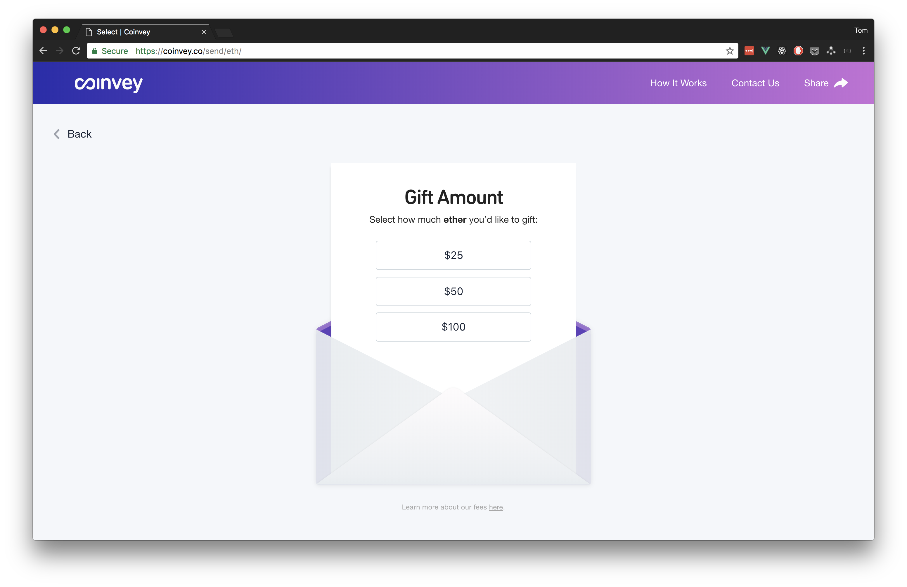
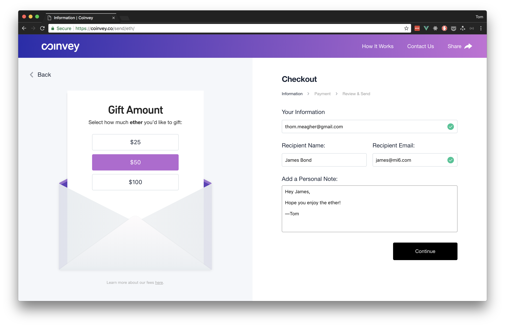
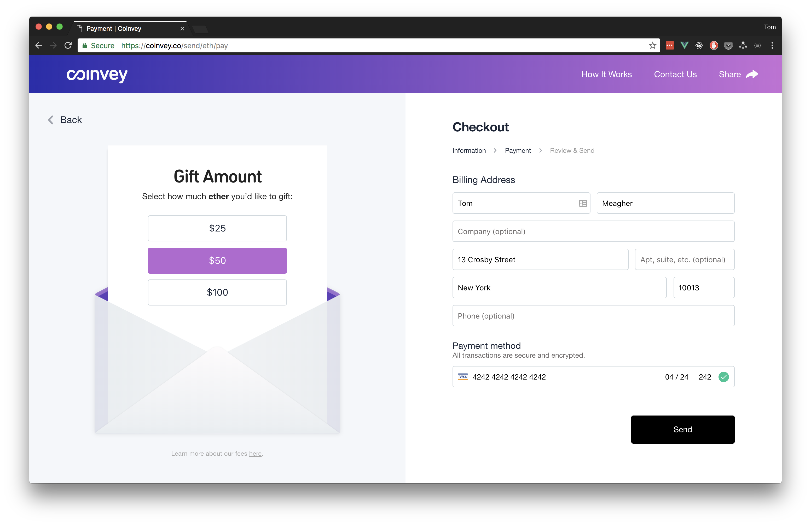
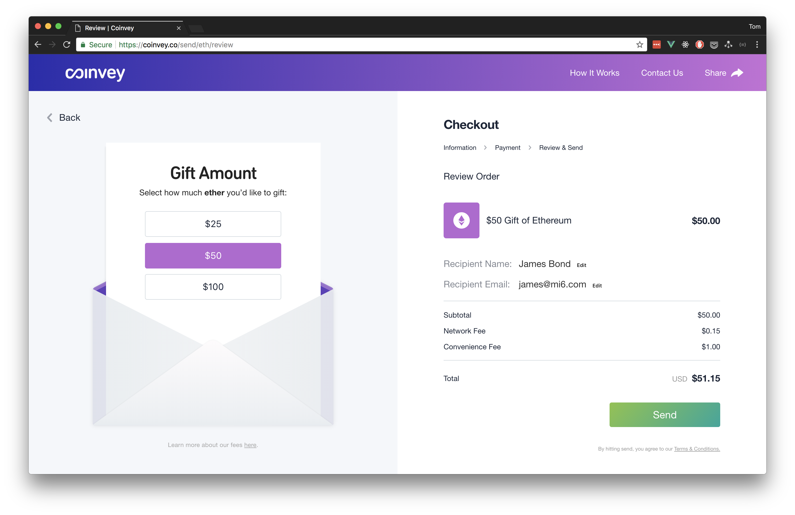
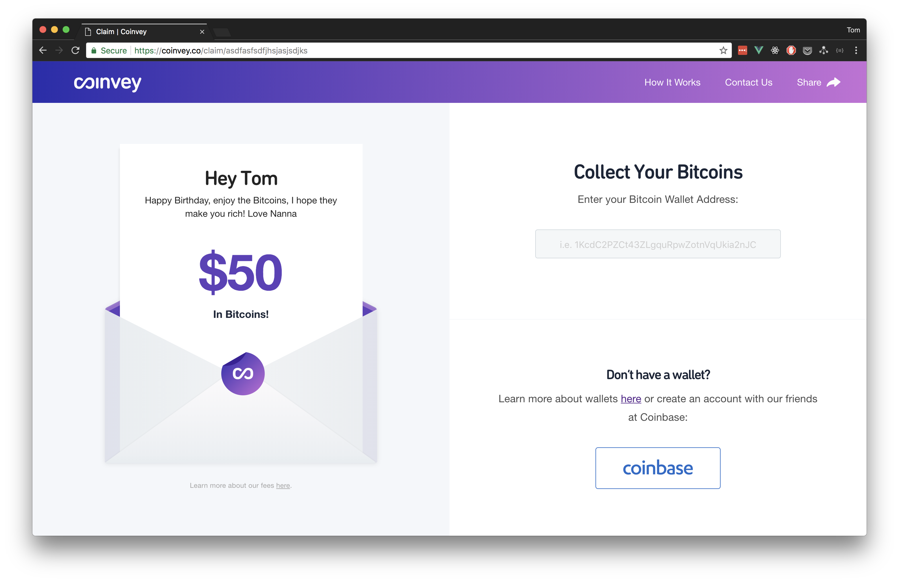
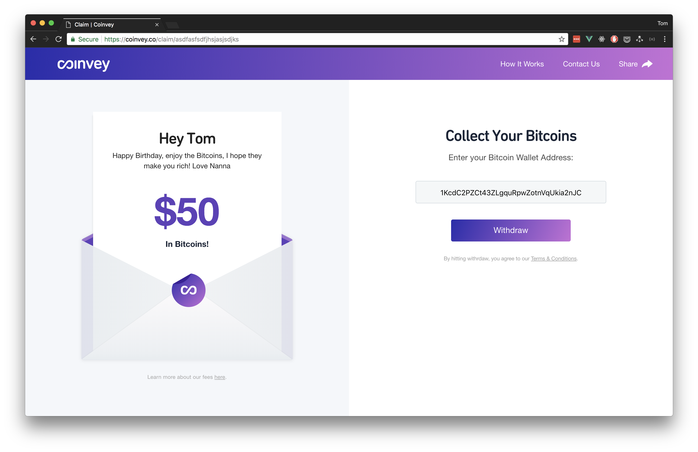
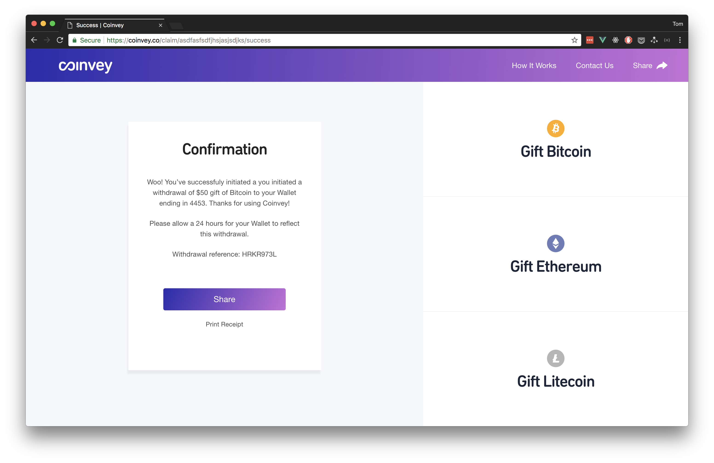
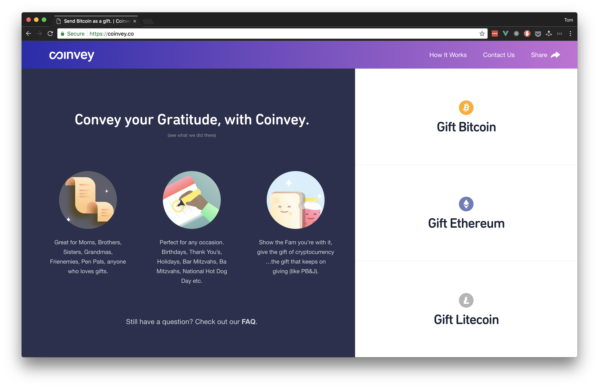
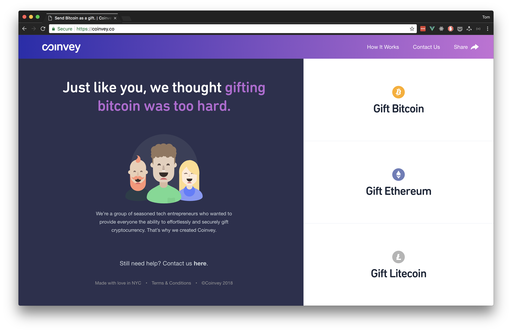
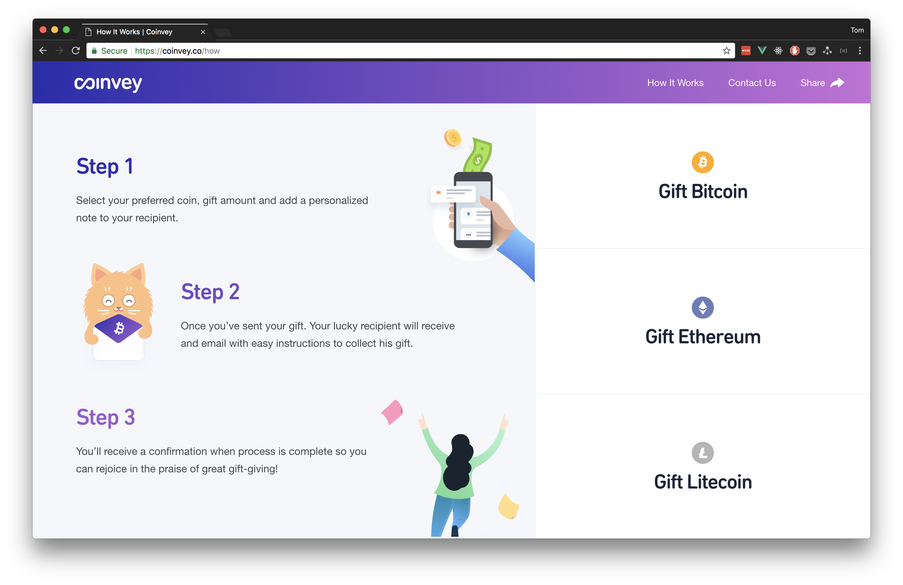

# Coinvey

> Send crypto as a gift.

## Build Setup

Set up `config/secrets.js`:

```js
module.exports = {
  firebase: {
    apiKey: '"XXXXXXXXXXXXXXXXXXXXXXXXXXXXXXXXXXXXXXX"',
    authDomain: '"domain.firebaseapp.com"',
    projectId: '"projectId"',
  },
  stripe: {
    key: '"pk_test_xxxxxxxxxxxxxxxxxxxxxxx"',
  },
};
```

To run from the command line:

``` bash
# install dependencies
yarn install

# serve with hot reload at localhost:8080
yarn run devc

# build for production with minification
yarn run build

# build for production and view the bundle analyzer report
yarn run build --report

# deploy to firebase
yarn run deploy
```

## Screenshots













## License

Released under the MIT license. See LICENSE for details.

